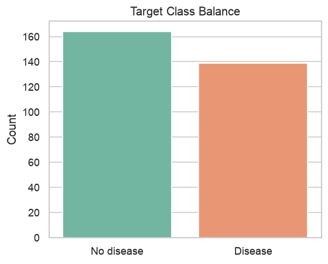
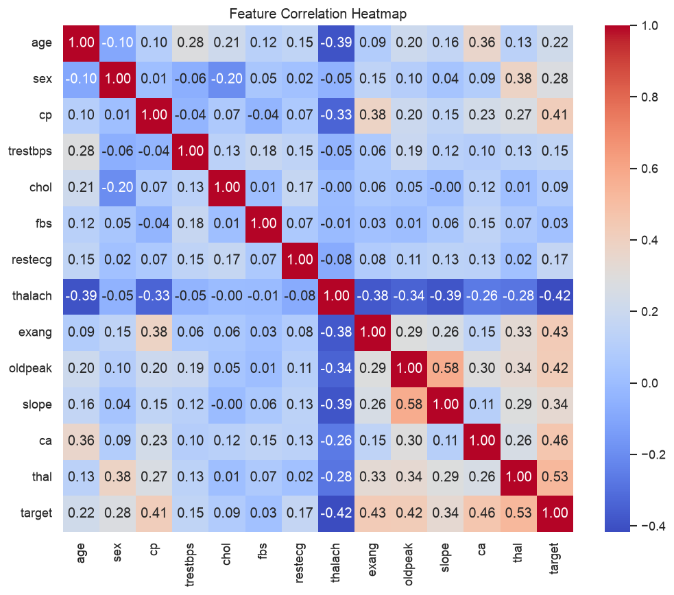
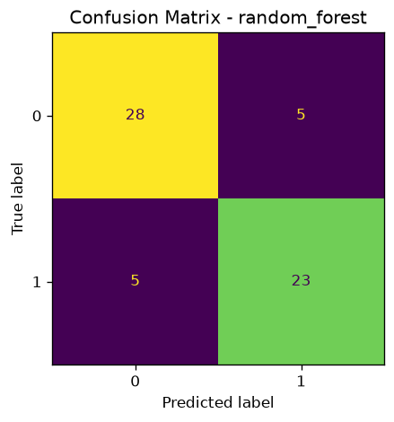
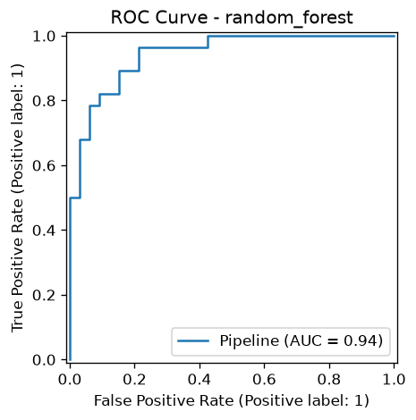
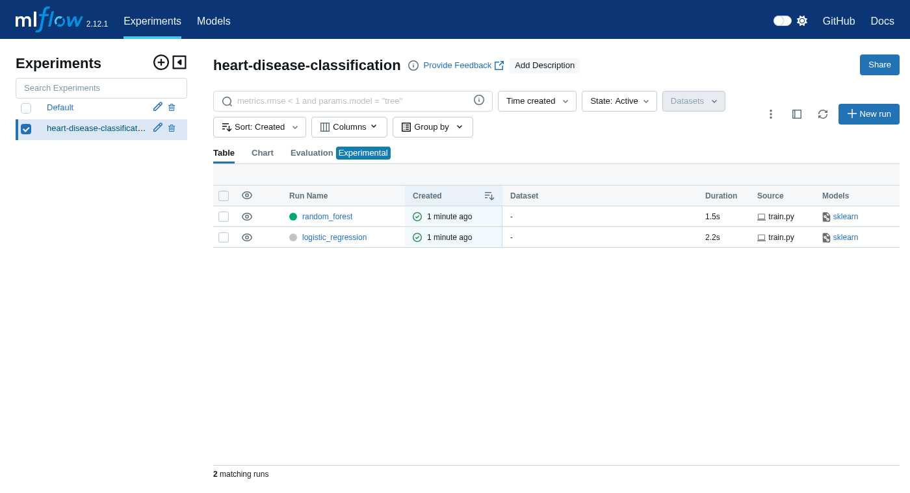
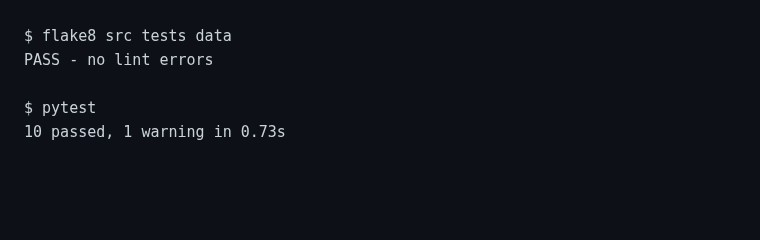
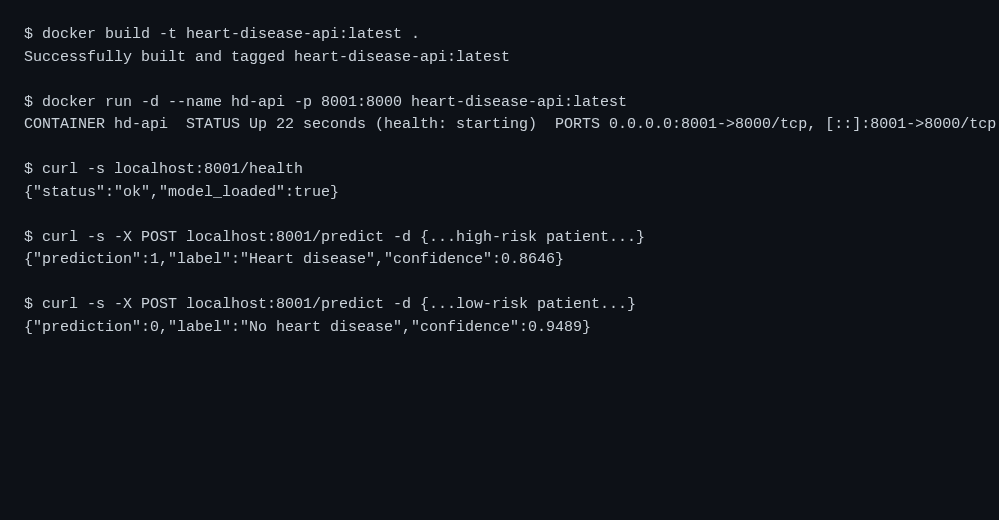
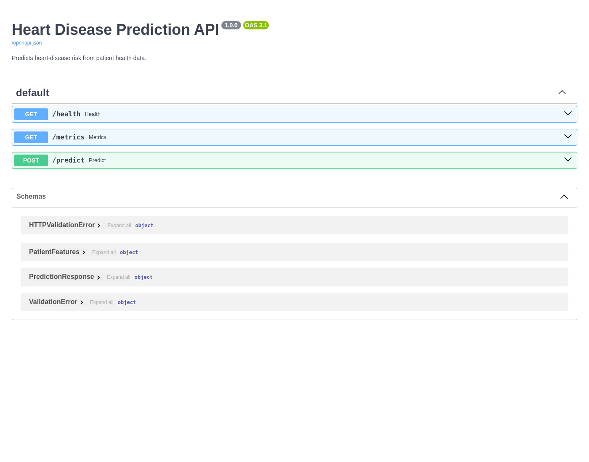
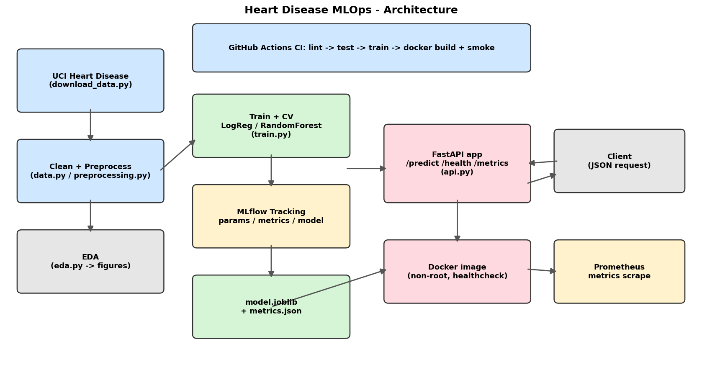

# Heart Disease Prediction — MLOps Project Report

**Course:** Machine Learning Operations (MLOps) — AIMLCZG523
**Assignment:** 01 — End-to-End ML Model Development, CI/CD, and Production Deployment
**Dataset:** UCI Heart Disease (Cleveland)

---

## 1. Introduction & Problem Statement

Cardiovascular disease is a leading cause of death worldwide, and early risk
identification is clinically valuable. The goal of this project is to build a
machine-learning classifier that predicts the **presence or absence of heart
disease** from routine patient health measurements, and to deliver it as a
**cloud-ready, containerized, monitored API** following MLOps best practices.

The solution covers the full lifecycle: data acquisition, EDA, feature
engineering, model development with experiment tracking, automated testing,
CI/CD, containerized serving, and monitoring.

---

## 2. Dataset

- **Source:** UCI Machine Learning Repository — `processed.cleveland.data`.
- **Size:** 303 records, 13 input features + 1 target.
- **Features:** `age`, `sex`, `cp` (chest-pain type), `trestbps` (resting BP),
  `chol` (cholesterol), `fbs` (fasting blood sugar), `restecg`, `thalach`
  (max heart rate), `exang` (exercise angina), `oldpeak`, `slope`, `ca`
  (major vessels), `thal`.
- **Target:** original severity is 0–4; per the problem statement we binarize
  it to **0 = no disease** and **1 = disease** (`target > 0`).

A download script (`data/download_data.py`) fetches the raw file and labels the
columns, guaranteeing a reproducible clean setup.

---

## 3. Data Cleaning & EDA

**Cleaning (`src/data.py`):**
- The `ca` and `thal` columns use `?` for missing values → converted to numeric
  `NaN` and imputed downstream (median / most-frequent).
- All columns coerced to numeric; target binarized.

**EDA (`src/eda.py`, `notebooks/01_eda.ipynb`):**

| Visualization | File |
|---------------|------|
| Target class balance | `reports/figures/class_balance.png` |
| Numeric feature distributions by target | `reports/figures/numeric_histograms.png` |
| Correlation heatmap | `reports/figures/correlation_heatmap.png` |
| Missing-value analysis + feature relationships | `notebooks/01_eda.ipynb` |

**Key observations:**
- The classes are reasonably balanced (~54% no disease / ~46% disease), so
  accuracy is a meaningful metric alongside ROC-AUC.
- `thalach` (max heart rate) is negatively associated with disease; `oldpeak`,
  `ca`, `cp`, and `exang` show clear separation between classes.




---

## 4. Feature Engineering & Modelling

All transformations live in a single scikit-learn `Pipeline` so that training
and serving apply **identical** preprocessing (`src/preprocessing.py`):

- **Numeric** (`age, trestbps, chol, thalach, oldpeak`): median imputation → `StandardScaler`.
- **Categorical** (`sex, cp, fbs, restecg, exang, slope, ca, thal`):
  most-frequent imputation → `OneHotEncoder(handle_unknown="ignore")`.

**Models compared (`src/train.py`, `notebooks/02_modeling.ipynb`):**
1. **Logistic Regression** — strong linear baseline. Tuned `C`.
2. **Random Forest** — non-linear ensemble. Tuned `n_estimators`, `max_depth`.

**Hyperparameter tuning:** each model is wrapped in the preprocessing pipeline
and tuned with **`GridSearchCV`** (5-fold, scoring = ROC-AUC).

**Selection:** best 5-fold CV ROC-AUC; the winning model is refit and persisted
to `models/model.joblib`.

### Results (20% held-out test set)

| Model | Best params | Accuracy | Precision | Recall | F1 | ROC-AUC | CV ROC-AUC |
|-------|-------------|----------|-----------|--------|-----|---------|------------|
| Logistic Regression | `C=0.1` | 0.89 | 0.84 | 0.93 | 0.88 | 0.97 | 0.898 |
| **Random Forest (selected)** | `n_estimators=100, max_depth=4` | 0.84 | 0.82 | 0.82 | 0.82 | 0.94 | **0.903** |

Random Forest was selected on the highest CV ROC-AUC. Both models achieve strong
recall, important for a screening use-case (minimizing missed positive cases).

### Confusion matrices & ROC curves




---

## 5. Experiment Tracking (MLflow)

Each training run logs to the `heart-disease-classification` experiment:
- **Parameters:** model name and best tuned hyper-parameters.
- **Metrics:** accuracy, precision, recall, F1, ROC-AUC, best CV ROC-AUC.
- **Plots:** confusion matrix and ROC curve (logged as artifacts).
- **Model:** the full serialized pipeline (`mlflow.sklearn.log_model`).



---

## 6. Model Packaging & Reproducibility

- Final pipeline saved with `joblib` (`models/model.joblib`) — includes
  preprocessing + estimator, so inference needs no separate feature code.
- Headline metrics saved to `models/metrics.json`.
- Pinned dependencies in `requirements.txt`; everything runs from a clean venv.

---

## 7. Testing & CI/CD

**Unit tests (`tests/`, pytest):**
- `test_data.py` — target binarization, missing-value handling, no input mutation.
- `test_model.py` — pipeline fits/predicts, outputs valid probabilities, handles
  missing values.
- `test_api.py` — `/health`, `/metrics`, `/predict` (valid + validation-error).



**CI (`.github/workflows/ci.yml`):**
`flake8` → `pytest` → download data + train (uploads model artifact) →
`docker build` → container smoke test on `/health` and `/predict`. The pipeline
**fails on any error** and surfaces clear logs.

---

## 8. Containerization & Deployment (Docker only)

Per the requested scope, deployment is **Docker-only** (no Kubernetes/Helm),
keeping it simple and portable.

The `Dockerfile` uses a **multi-stage build** on a **pinned, digest-locked**
`python:3.10.14-slim` base, runs as a **non-root** user, and defines a
**HEALTHCHECK** against `/health`.

```bash
docker build -t heart-disease-api:latest .
docker run -d -p 8000:8000 heart-disease-api:latest
```




The container builds and runs locally, and correctly serves sample inputs
(positive and negative cases), returning a prediction and confidence.

---

## 9. Monitoring & Logging

- **Request logging:** middleware logs method, path, status, and latency for
  every request.
- **Metrics:** `/metrics` exposes Prometheus counters/histograms
  (`api_requests_total`, `api_request_latency_seconds`, `predictions_total`),
  ready for a Prometheus + Grafana dashboard.

---

## 10. Architecture



Data flows from acquisition → cleaning/preprocessing → training with MLflow
tracking → a saved pipeline artifact → the FastAPI app → a Docker image, with
CI/CD orchestrating lint/test/train/build and Prometheus scraping runtime metrics.

---

## 11. How to Reproduce

The data/ML workflow is provided as runnable notebooks in `notebooks/`
(`01_eda.ipynb`, `02_modeling.ipynb`, `03_inference.ipynb`) and as scripts in
`src/`. See `README.md` for full commands. In short:

```bash
python -m venv .venv && source .venv/bin/activate
pip install -r requirements.txt

# Option A - notebooks (data, EDA, modelling, inference)
jupyter notebook      # run 01 -> 02 -> 03

# Option B - scripts
python data/download_data.py && python -m src.train

# Tests + serve via Docker
pytest && flake8 src tests data
docker build -t heart-disease-api:latest .
docker run -d -p 8000:8000 heart-disease-api:latest
```

---

## 12. Conclusion

The project delivers a reproducible, tested, containerized, and monitored heart
disease prediction service. Both candidate models perform strongly
(ROC-AUC ≈ 0.94–0.97); Random Forest was selected via cross-validation. The
pipeline is production-oriented: identical train/serve preprocessing, pinned
dependencies, a secure non-root Docker image, automated CI/CD, and Prometheus
metrics for observability.
